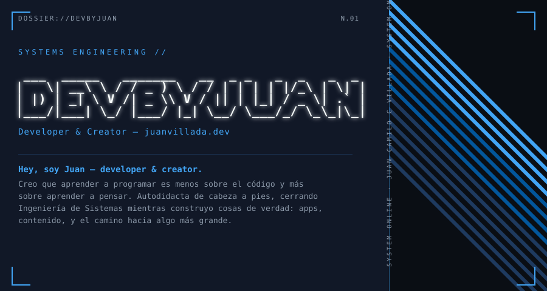
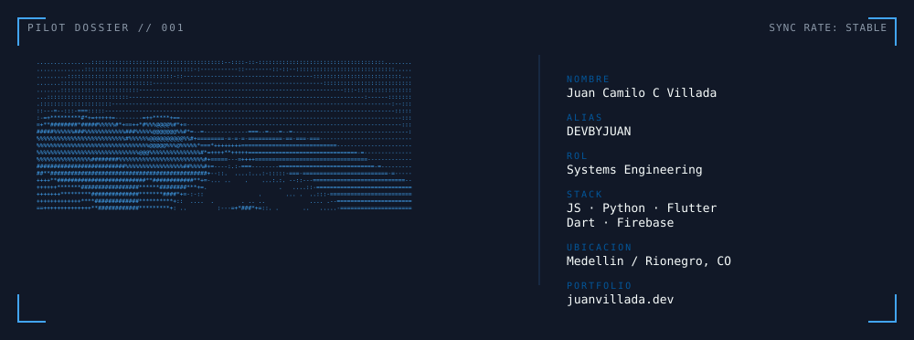

 

 

Hey, soy **Juan** — developer & creator.

Creo que aprender a programar es menos sobre el código y más sobre aprender a pensar. Autodidacta de cabeza a pies, cerrando **Ingeniería de Sistemas** mientras construyo cosas de verdad: apps, contenido, y el camino hacia algo más grande.

 

## `// STACK`

  
  
  
  
  
  
  
  

 

## `// CURRENTLY BUILDING`

**FinanceXP** — El cuaderno de registro de tu vida financiera, gamificado: cada dólar que ahorras te sube de nivel. Lo que no se mide, no se controla — FinanceXP hace que medir se sienta como progreso.

  

 

## `// SYSTEM METRICS`

  

 

## `// TRANSMISSION`

Contenido sobre bases del desarrollo, vida de ingeniero y mentalidad dev — no solo código, sino el proceso completo de construir.

  
  
  
  

 

`SYSTEM://` [juanvillada.dev](https://juanvillada.dev)

